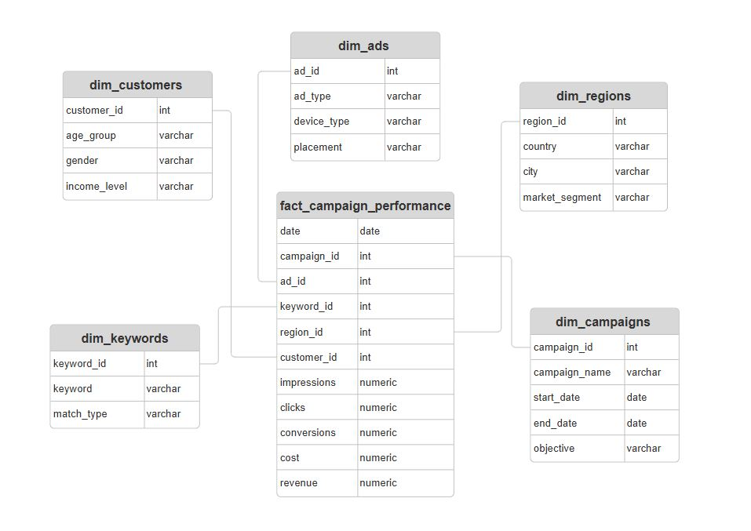
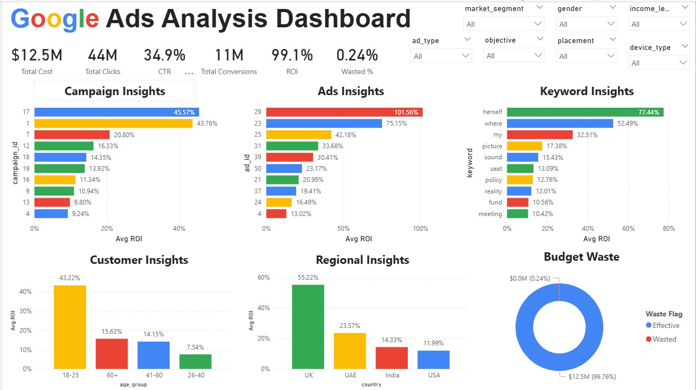
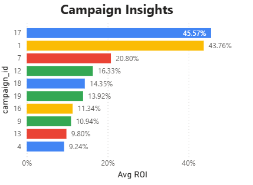
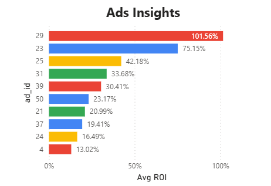
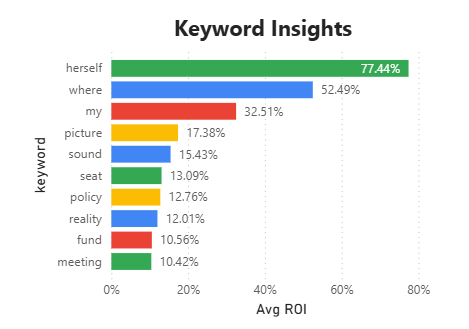
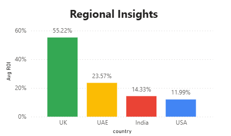
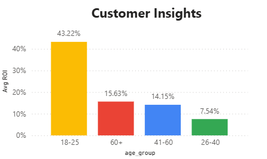
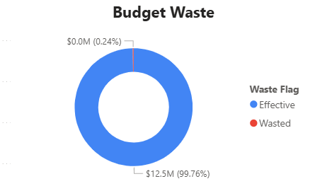

# Google Ads Analysis

This project analyzes **Google Ads campaign performance** for a digital marketing company operating across multiple regions. Since the business relies heavily on paid ads to acquire customers, **ad spend is both expensive and highly competitive**.  

The goal of this analysis is to uncover **critical insights** about ad performance, identify inefficiencies, and provide actionable recommendations to optimize budget allocation.  

Key business questions addressed:
- Which campaigns and ads generate the highest ROI and CTR? 
- Which keywords drive the most traffic and conversions vs. waste budget? 
- How does ad performance vary across regions and customer demographics?  
- What portion of budget is being wasted on low CTR/high CPC ads?  

**SQL Queries** – [Click Here](sql) 

**Python Notebooks** – [Click Here](notebooks) 

**Excel Preliminary Report** – [Click Here](excel_report)  

**Interactive Power BI Dashboard** – [Click Here](powerbi_dashboard)  

---

## Data Structure and Preparation  

The database consisted of **6 tables**:  
- **dim_ads** – Ad details  
- **dim_campaigns** – Campaign-level metadata  
- **dim_customers** – Customer demographics  
- **dim_keywords** – Keywords linked to ads  
- **dim_regions** – Regional mapping  
- **fact_campaign_performance** – Fact table with impressions, clicks, conversions, cost, and revenue  

The main fact table (**fact_campaign_performance**) contained **50,000 records**.  

**Entity Relationship Diagram (ERD)**  
  

### Data Cleaning & Preparation  
Before analysis, several preprocessing steps were applied:  
- Corrected improper data types.  
- Handled **NULL values** using imputation or removal.  
- Fixed typos and inconsistencies.  
- Derived new metrics (CTR, CVR, CPC, ROI, Revenue per Conversion).  

---

## Executive Summary  

### Key Findings  
- A **small number of campaigns and keywords drive most ROI**, while many underperform.  
- **UK region and the 18–25 age group** deliver the highest ROI, suggesting targeted reallocation of budget.  
- Less than **0.3% of ad spend is wasted**, but the waste is concentrated in **low CTR / high CPC ads**.  

**Dashboard Preview**  
  
  

---

## Insights Deep Dive  

### 1. Campaign & Ad Insights  
- **Campaigns 17 & 1** lead in ROI (>43%).  
- **Ads 29 & 23** achieved ROI >70%, while many others underperformed.  

  
  

---

### 2. Keyword Insights  
- Top keywords (**“herself”, “where”**) generated ROI >50%.  
- Several keywords showed **high spend but low conversions**, signaling wasted budget.  

  

---

### 3. Regional Insights  
- **UK** achieved the highest ROI (55%), followed by **UAE (23%)**.  
- **India & USA underperformed** (<15% ROI).  

  

---

### 4. Customer Insights  
- **Age group 18–25** showed the strongest ROI (>40%).  
- Older age groups had declining ROI, suggesting reduced effectiveness.  

  

---

### 5. Budget Waste Analysis  
- Only **0.24% of total spend** was wasted.  
- Wasted budget was concentrated in **low CTR / high CPC ads**.  

  

---

## Recommendations  
- **Increase spend** on high ROI campaigns (e.g., 17, 1) and keywords (“herself”, “where”).  
- **Pause or reduce** underperforming campaigns and ads.  
- **Reallocate budget** to high-performing regions (UK) and younger demographics (18–25).  
- **Audit and refine** underperforming keywords with high CPC to reduce wasted spend.  

---

## Assumptions & Caveats  
- Missing values in clicks, impressions, and conversions were imputed with **medians**.  
- Nulls in **Revenue per Conversion** (≈0.2%) were retained, as they likely indicate incomplete tracking.  
- Logical inconsistencies (e.g., clicks > impressions) were removed.  
- Dataset is **simulated** and may not perfectly reflect real-world Google Ads tracking.  

---

## Project Artifacts  
- **SQL Queries** – [Click Here](sql)  
- **Python Notebooks** – [Click Here](notebooks)  
- **Excel Preliminary Dashboard** – [Click Here](excel_report)  
- **Power BI Executive Dashboard** – [Click Here](powerbi_dashboard)  

---

## Dashboard Snapshots  

### Excel Preliminary Report  
  

### Power BI Executive Dashboard  
  
